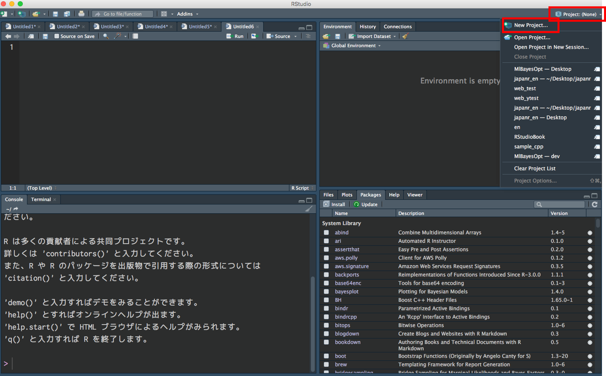
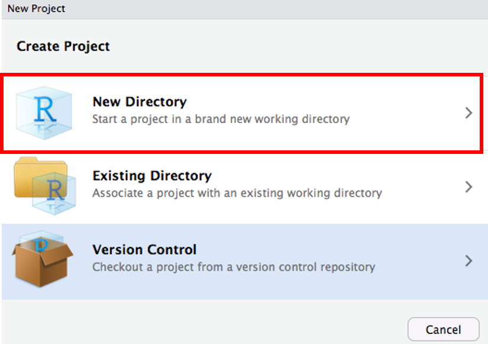
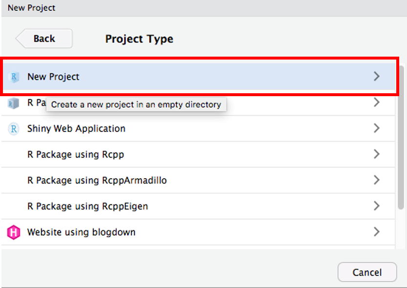
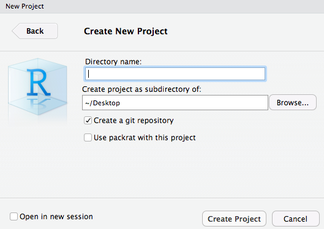
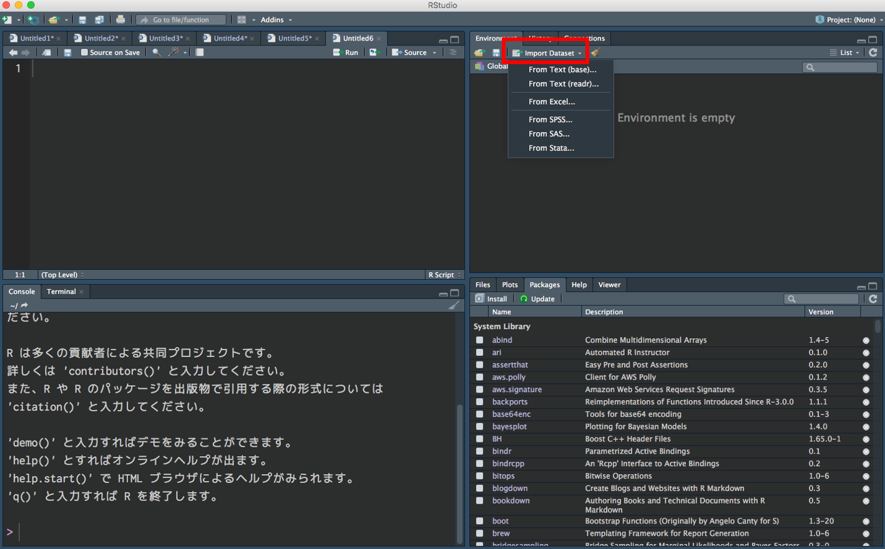
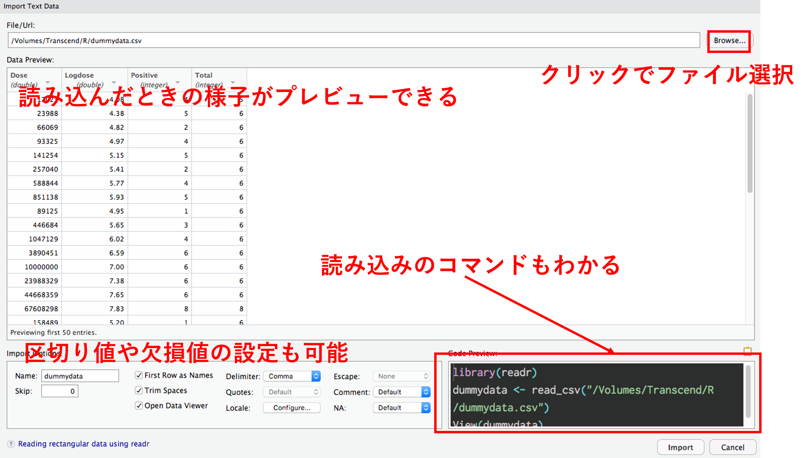

```{r eval=TRUE, echo=FALSE, warning=FALSE, message=FALSE, comment=""}
knitr::opts_chunk$set(echo = TRUE,
                      eval = TRUE,
                      warning = FALSE,
                      message = FALSE,
                      comment = "",
                      fig.height = 10,
                      fig.width = 10,
                      out.height = 400,
                      out.width = 800)
options(dplyr.print_max = 1e9)
```

# はじめに

## 誰？

<div class="column1">
- 松村優哉
- <u>Twitter</u>: **y\_\_mattu**
- <u>GitHub</u>: **ymattu**
- 大学院生
- 計量経済学、ベイズ統計、因果推論、マーケティング
- 言語: R, Python
- https://ymattu.github.io/
- http://y-mattu.hatenablog.com/
- Tokyo.R 運営(雑用, 音響)
</div>

<div class="column2">

</div>

## アルバイトとか
- コミュニケーションアプリの分析
- Web 広告のログ解析
- ヘルスケア系とかいろいろやるところ←イマココ
- たまに受託

## 著書(共著)
#### **R ユーザのための RStudio[実践]入門 <br> − tidyverse によるモダンな分析フローの世界−**
<div class="column1">

</div>

<div class="column2">
通称: 「**宇宙本**」

1. RStudio 入門(@y\_\_mattu)
2. スクレイピングによるデータ取得(@y\_\_mattu)
3. dplyr を中心としたデータハンドリング(@yutannihilation)
4. ggplot2 による可視化(@kyn02666)
5. R Markdown によるレポーティング(@kazutan)

</div>

## 作ったパッケージ
### [MlBayesOpt](https://github.com/ymattu/MlBayesOpt)
- 機械学習のパラメーターをベイズ最適化でチューニングする R パッケージ
- メンテ頑張ります...

### [rjumanpp](https://github.com/ymattu/rjumanpp)
- 形態素解析機 JUMAN++の R ラッパー
- 最低限の機能しかないのでメンテ頑張ります...


# さあ、R でデータ分析だ!
## データ分析の(おおまかな)流れ

```{r echo=FALSE}
library(DiagrammeR)

grViz("
digraph data_analytics {

      # graph
      graph [overlap = true, fontsize = 10]

      # node
      node [shape=box,
      fontname = Helvetica,
      style = filled,
      fillcolor = SteelBlue,
      fontcolor = white]
      データ読み込み;

      node [shape = box,
      fontname = Helvetica,
      fillcolor = Gray,
      fontcolor = black]
      可視化・モデリング; 前処理;

      # edge
      データ読み込み->前処理
      前処理->可視化・モデリング
      }
      ")
```


## まずは何よりも、 <br> 「**データの読み込み**」ですよね
R で分析するためには、データを R に読み込まなければなりません。

## 本当にあった怖い話
- データソースがバラバラ（csv, xls(x), データベース）
- データのファイル名が統一されてない（数字、カタカナの全角半角）
- 拡張子がtsvなのに中身はカンマ区切り
- 月ごとにファイルが分かれているが、月によってエンコーディングが違う

## 悲しいことに。。。
- データの読み込みに関しては、素人玄人関係なく同じような問題にぶつかります。
- 今日話すのは基礎的な話なので、ファイル名とかそのへんはあとで直接聞いてください


## R でこれに対処するには？ {#howtodeal}
0. RStudio でプロジェクトを作成
    - ファイルの位置が分かりやすくなります
1. 様々な読み込み関数を使って読み込み
    - **ローカルにあるファイル**(今日の中心)
    - **データベース**(パッケージの紹介のみ)
    - Web スクレイピング(またの機会に...)

# RStudio でプロジェクトを作成
## Project → New Project


## New Directory → New Project {#newproj}
<div class="column1">

</div>

<div class="column2">

</div>

## ディレクトリ名を入力


## Done!
- 読み込みの関数は、プロジェクトの中のファイルを探しにいきます。
- `setwd()`
を書く必要はありません

# いよいよデータの読み込み
## の前にもうひとつだけ
### パッケージ内の関数の表記
- R はパッケージでたくさんの機能を追加できる( `install.packages("パッケージ名")` でインストール)
**readr** パッケージの read_csv 関数を使いたいとき
```{r eval=FALSE}
# 方法 1
library(readr)
dat <- read_csv("hoge.csv")

# 方法 2
dat <- readr::read_csv("hoge.csv")
```

# ローカルにあるファイル

# csv
## `read.csv()`
- 多くの人が勉強し始めた頃に習う関数
```{r eval=FALSE}
dat <- read.csv("sample.csv", stringsAsFactors = FALSE)
```

## `readr::read_csv()`
- 高速で、列の方をいい感じにやってくれる(オススメ)
```{r eval=FALSE}
library(readr)
dat <- read_csv("sample.csv")
```

## `data.table::fread()`
- `readr::read_csv()`
よりも高速
- デフォルトでは、data.table というデータフレームとは別の形で読み込まれるのでデータフレームがいいときは `data.table = FALSE`

```{r eval=FALSE}
library(data.table)
dat <- fread("sample.csv", data.table = FALSE)
```

# 高速ってどのくらい速いの？

## 速度検証
<div class="column1">
### 検証用データ
- ECサイトのログデータ <br> (を意識して作ったデータ)
- csv
- 100 万行× 3 列
- 約 45MB
- https://github.com/ymattu/SampleData
</div>

<div class="column2">
### 検証環境
- macOS Mojave 10.13.2
- Corei7
- メモリ 16GB
- R 3.6.0
</div>

## 時間を計測
```{r eval=TRUE}
system.time(dat <- read.csv("data/Sales.csv"))
system.time(dat2 <- readr::read_csv("data/Sales.csv"))
system.time(dat3 <- data.table::fread("data/Sales.csv"))
```

## もっとちゃんと時間を知りたい
- **microbench** パッケージ
- 比較したい関数を1000回ずつとか実行して見やすく表示してくれる

```{r, eval=FALSE}
library(microbenchmark)
file <- "data/Sales.csv"
compare <- microbenchmark("read.csv()" = read.csv(file),
                          "readr::read_csv()" = readr::read_csv(file),
                          "data.table::fread()" = data.table::fread(file),
                          times = 1000)
```

```{r, echo=FALSE}
library(ggplot2)
library(microbenchmark)
compare <- readr::read_rds("inst/compare.RData")
```


## 結果1 {#result1}
```{r, eval=FALSE}
compare
```
|expr                |       min|        lq|      mean|    median|        uq|      max| neval|
|:-------------------|---------:|---------:|---------:|---------:|---------:|--------:|-----:|
|read.csv()          | 1871.3155| 2222.0066| 2361.4660| 2347.1315| 2452.3060| 4529.984|  1000|
|readr::read_csv()   |  548.7358|  811.9076|  882.2824|  860.2287|  935.6320| 1759.994|  1000|
|data.table::fread() |  557.9172|  617.1047|  648.5004|  643.6659|  664.1492| 1138.720|  1000|

## 結果2 {#result2}
```{r}
autoplot(compare)
```

# tsv
## `read.delim()`
- `read.delim()`は区切り値のファイルを読む標準関数
- `read.csv()`は `sep = ","`をつけたもの
```{r eval=FALSE}
dat <- read.delim("sample.tsv", stringsAsFactors = FALSE)
```

## `readr::read_tsv()`
```{r eval=FALSE}
library(readr)
dat <- read_tsv("sample.tsv")
```

## `data.table::fread()` {#fread2}
- 区切り値は勝手に判断
```{r eval=FALSE}
library(data.table)
dat <- fread("sample.tsv", data.table = FALSE)
```

# その他の区切り値

## `read.delim()`
```{r eval=FALSE}
dat <- read.delim("sample.tsv", stringsAsFactors = FALSE, sep = "|")
```

## `readr::read_delim()`
```{r eval=FALSE}
library(readr)
dat <- read_delim("sample.tsv", "|")
```

## `data.table::fread()` {#fread3}

```{r eval=FALSE}
library(data.table)
dat <- fread("sample.tsv", data.table = FALSE)
```

# 結局？
## どれがいいのか
- **readr**パッケージの `read_***()`関数が一番オススメ
- 速い、エンコーディングの調整が難しくない(後述)

|                        | read.\*\*\* | read_\*\*\* | fread |
|------------------------|----------|----------|-------|
| 速さ(45MB)            | 3秒    | 0.8 秒      |  0.6秒   |
| 区切り値の判定ミス   | ×        | ×        | △     |
| エンコーディング | ○        | ○        | △     |

# xlsx, xls
## エクセルファイル
### エクセルファイルを読み込めるパッケージ
- xlsx
- gdata
- XLConnect
- openxlsx
- **readxl** → オススメ(速い、列の型をいい感じに読める)

## 読み込み方
```{r eval=FALSE}
dat <- readxl::read_excel("sample.xlsx", sheet = "シート名")
# シート名はシート番号でも OK
```

# その他の拡張子
## SAS(.sas7bdat), STATA(.dta), SPSS(.sav)形式のファイル
**haven** パッケージで読み込み

#### SAS
```{r eval=FALSE}
dat <- haven::read_sas("sample.sas7bdat")
```

#### STATA
```{r eval=FALSE}
dat <- haven::read_dta("sample.dta")
```

#### SPSS
```{r eval=FALSE}
dat <- haven::read_sav("sample.sav")
```

# 文字コードの指定
## エンコーディング問題
- Windows の文字コードは **Shift-JIS（CP932）**
- Mac の文字コードは **UTF8**
- Windows で作られた（日本語を含む）ファイルを Mac で読むときは `Encoding=cp932`
- Mac で作られた（日本語を含む）ファイルを Windows で読むときは `Encoding=UTF8`

## csv を CP932 で読む
### R の標準関数
```{r eval=FALSE}
dat <- read.csv("sample.csv", stringAsFactors = FALSE, fileEncoding = "cp932")
```

### readr
```{r eval=FALSE}
dat <- readr::read_csv("sample.csv", locale = locale(encoding = "cp932"))
```

### data.table
```{r eval=FALSE}
dat <- data.table::fread("sample.csv", data.table = FALSE) %>%
  dplyr::mutate(VAR1 = iconv(VAR1, from = "UTF8", to = "CP932"))
```

# 関数とかオプションとか <br> 覚えられない
## RStudio の GUI 読み込み {#importdataset1}




## RStudio の GUI 読み込み {#importdataset2}


# データベース(クラウド)編
## データベースやクラウド上のデータ
- 企業にデータは膨大なのでクラウドにデータを置くことがとても多い
- こういうデータを R から直接触れたら嬉しいですよね！

## 便利パッケージたち
- **DBI**(データベースへの接続)
- **dplyr(dbplyr)**(データベースのテーブル操作)
- **sparklyr**(Spark, AWS S3)
- **bigrquey**(Big Query)
- RStudio の Connection タブ

## データベース関連の参考資料たち
- [dplyr でデータベース操作](https://qiita.com/nozma/items/f9a20d9ce0f7bfbdf628)
- [PostgreSQL からスキーマを指定してデータを参照する](https://qiita.com/uri/items/5a90f1c1c5edc8813c01)
- [これからはコネの時代](https://speakerdeck.com/yutannihilation/korekarahakonefalseshi-dai)

# Web スクレイピング
## 時間がないので省略
<div class="column1">

</div>

<div class="column2">

</div>


# もっと! もっと!
## R は他にもいろいろなデータを読み込めます {#others}
- 地理情報データ
- 画像
- 音声
- etc...

ググると、意外といろいろ出てきます

# まとめ
## なんか、R でデータ分析ができそうな気がしてきましたよね!？ {#matome1}

## 本スライドは **revealjs**パッケージを <br> 用いて作成しています {#matome2}
下記 URL でソースコードを公開しています

https://github.com/ymattu/TokyoR78

## Enjoy!!
